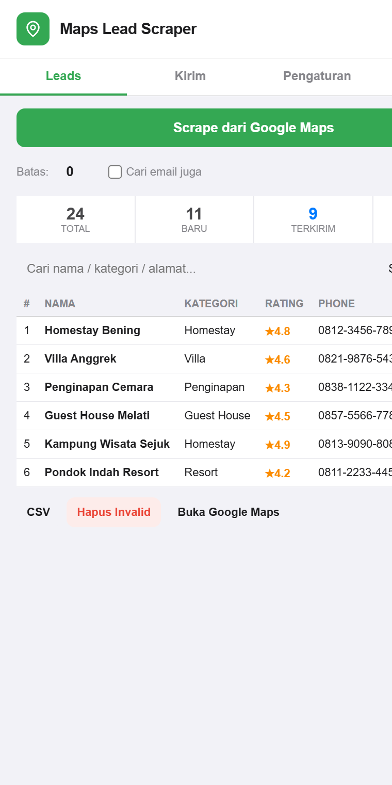
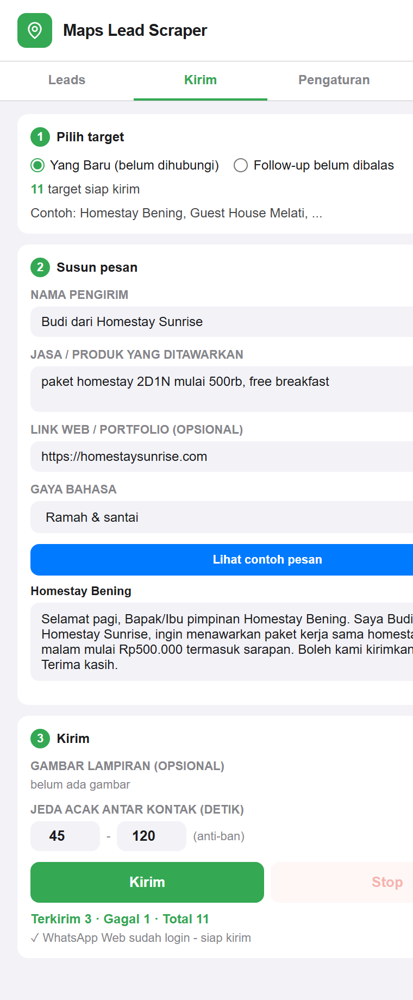
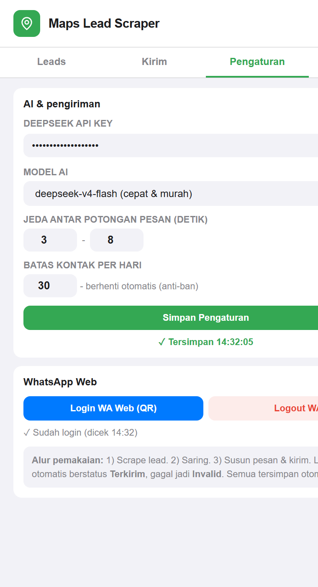
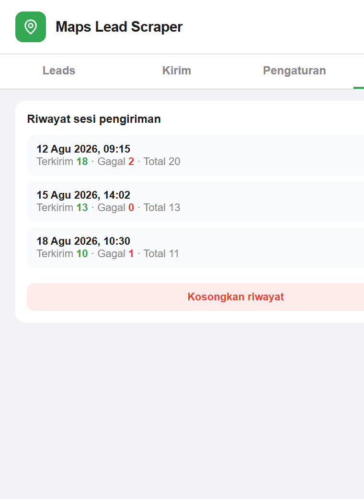

# 🗺️ Maps Lead Scraper — Ekstensi Chrome

> **Kumpulkan → Saring → Kirim → Lacak → Follow-up**
> Scrape bisnis dari Google Maps, kirim penawaran via WhatsApp secara personal (didukung AI DeepSeek), dan kelola follow-up — semua dalam satu panel samping.



## ✨ Fitur utama

| Fitur | Keterangan |
|---|---|
| **Scrape Google Maps** | Ambil nama, kategori, rating, alamat, telepon, website, email dari hasil pencarian |
| **Database lead lokal** | Tersimpan permanen di browser (tanpa server) — tahan tutup Chrome |
| **Status per lead** | `Baru` → `Terkirim` → `Dibalas` / `Invalid` / `Skip` — terlacak & tersimpan otomatis |
| **Kirim WhatsApp (Auto)** | Ketik & kirim otomatis di WhatsApp Web, kecepatan mengetik seperti manusia, pesan dipecah jadi beberapa bubble pendek |
| **Pesan personal AI** | DeepSeek V4 Flash merangkai pesan unik per bisnis (nama, kategori, penawaran, gaya bahasa) |
| **Kirim gambar** | Lampirkan 1+ gambar bersama pesan |
| **Anti-ban** | Urutan diacak, jeda acak antar kontak, batas harian otomatis |
| **Follow-up terjadwal manual** | Filter "belum dibalas ≥ N hari" — pesan follow-up berbeda dari pesan pertama |
| **Riwayat sesi** | Setiap sesi pengiriman tercatat (tanggal, mode, terkirim/gagal) |
| **Export CSV** | Termasuk kolom status & tanggal |

## 📸 Tampilan

| Tab Leads — database & status | Tab Kirim — target, pesan, kirim |
|---|---|
|  |  |

| Tab Pengaturan — AI & WA Web | Tab Riwayat — sesi pengiriman |
|---|---|
|  |  |

## 🚀 Instalasi

1. Buka `chrome://extensions`
2. Aktifkan **Developer mode** (pojok kanan atas)
3. Klik **Load unpacked** → pilih folder project ini
4. (Opsional) isi **API key DeepSeek** di tab Pengaturan untuk pesan otomatis

## 📖 Cara pakai

### Tab 1 — Leads (Kumpulkan & Saring)
1. Buka [Google Maps](https://www.google.com/maps), lakukan pencarian (mis. *homestay di Bandung*)
2. Klik **Scrape dari Google Maps** — hasil masuk ke database
3. Saring dengan pencarian / filter status
4. Atur status per lead (dropdown): tandai `Dibalas` yang merespons, `Skip` yang tidak relevan

### Tab 2 — Kirim (Kirim & Lacak)
1. **Pilih target**: semua yang `Baru`, atau `Follow-up` yang belum dibalas ≥ N hari
2. **Susun pesan**: isi nama pengirim, jasa/produk, link, gaya bahasa — lalu **Lihat contoh pesan** untuk cek hasil AI (atau tulis manual dengan placeholder `{nama}`)
3. **Kirim**: (opsional) lampirkan gambar, atur jeda, klik **Kirim**
4. Pantau progress `Terkirim · Gagal · Total` secara live

### Tab 3 — Pengaturan
- **DeepSeek API Key** — wajib untuk pesan otomatis AI (opsional, tanpa key tetap bisa kirim pakai template)
- **Model AI** — `deepseek-v4-flash` (cepat/murah) atau `deepseek-v4-pro`
- **Batas kontak per hari** — proteksi anti-ban
- **Login / Logout WhatsApp Web** — login sekali via scan QR, status tersimpan

### Tab 4 — Riwayat
- Lihat semua sesi pengiriman: kapan, target apa, berapa terkirim/gagal

## 🔄 Alur kerja (Kumpulkan → Saring → Kirim → Lacak → Follow-up)

```
HARI 1  Scrape 20 homestay        → 20 Baru
        Kirim (target: Baru)      → 18 Terkirim, 2 Invalid (tidak punya WA)
HARI 2  5 balas → tandai Dibalas
HARI 4  Kirim (target: Follow-up ≥ 3 hari) → hanya 13 yang belum balas
        Pesan follow-up di-generate berbeda (konteks tindak lanjut)
        Tidak pernah kirim ulang ke yang sudah Dibalas / Invalid / Skip
```

## ⚠️ Anti-ban WhatsApp — cara kerja & batasannya

- Urutan kontak **diacak**, jeda antar kontak **acak** (default 45–120 detik), **batas harian** otomatis berhenti
- Pesan AI berbeda per target → tidak terlihat copy-paste massal
- Teks panjang dipecah menjadi beberapa pesan pendek (150–300 karakter)
- **Jujur soal batasan**: fitur ini mengetik & mengirim otomatis di WhatsApp Web — tetap ada risiko ban untuk volume besar. Mulai dari 10–20 kontak/hari, pantau, lalu naikkan bertahap. Tidak ada jaminan anti-ban mutlak.

## 💾 Penyimpanan & privasi

- Semua data (lead, status, riwayat, settings) disimpan di **`chrome.storage.local`** — JSON di profil Chrome, **permanen di disk**, tanpa server, tanpa database eksternal
- **API key DeepSeek** hanya tersimpan di browser kamu — **tidak pernah** masuk ke kode repo
- Tidak ada data yang dikirim ke pihak ketiga selain request API DeepSeek (hanya saat generate pesan) dan request ke website bisnis (saat cari email)

## 🧩 Persyaratan

- Chrome (Manifest V3)
- Login **WhatsApp Web** sekali (scan QR) untuk mode kirim otomatis
- API key DeepSeek (opsional, untuk pesan AI): daftar di platform.deepseek.com
- Selector DOM Google Maps & WhatsApp Web bisa berubah kapan saja oleh pihak Google/WhatsApp — perlu penyesuaian berkala

## 📄 Riwayat versi

- **v3.8.4** — tombol Logout WA Web (reset status + auto-logout)
- **v3.8.3** — penyimpanan settings bulletproof: tombol Simpan eksplisit, save di blur/pindah-tab/tutup-panel, anti-autofill
- **v3.8.2** — auto-save settings, status login WA persisten, `unlimitedStorage`
- **v3.8.1** — fix deteksi login WA (cek shell aplikasi) + auto-reload tab
- **v3.8** — riwayat sesi pengiriman + history per lead (tooltip)
- **v3.7** — desain ulang total: 3 tab, status per lead, hapus fitur tak berfungsi (Sheets/Excel, checkbox, Save/Load)
- **v3.6** — input gambar, settings AI terstruktur (jasa/produk, link, gaya bahasa), monitoring terkirim/gagal
- **v3.5** — auto-send WhatsApp via DeepSeek V4 Flash, split teks, ketik manusiawi, daily cap
- **v3.4** — fix phone (PUA + click-to-reveal), fix email (pindah ke side panel, bebas CORS), fitur WA manual
- **v3.3** — optimasi kecepatan: MutationObserver, email paralel + cache, debounce UI

## 📁 Struktur file

```
├── manifest.json    # MV3 — permissions, content scripts, side panel
├── background.js    # Service worker — buka/aktifkan side panel
├── content.js       # Content script Google Maps — scrape + detail
├── whatsapp.js      # Content script WhatsApp Web — ketik & kirim
├── sidepanel.html   # UI side panel (3 tab)
├── sidepanel.js     # Logika panel: status, kirim, follow-up, riwayat
└── docs/screenshots # Screenshot UI untuk README
```

## 📜 Lisensi

Proyek asli: [ahmadasrizalmi/maps-scraper-extension](https://github.com/ahmadasrizalmi/maps-scraper-extension)
